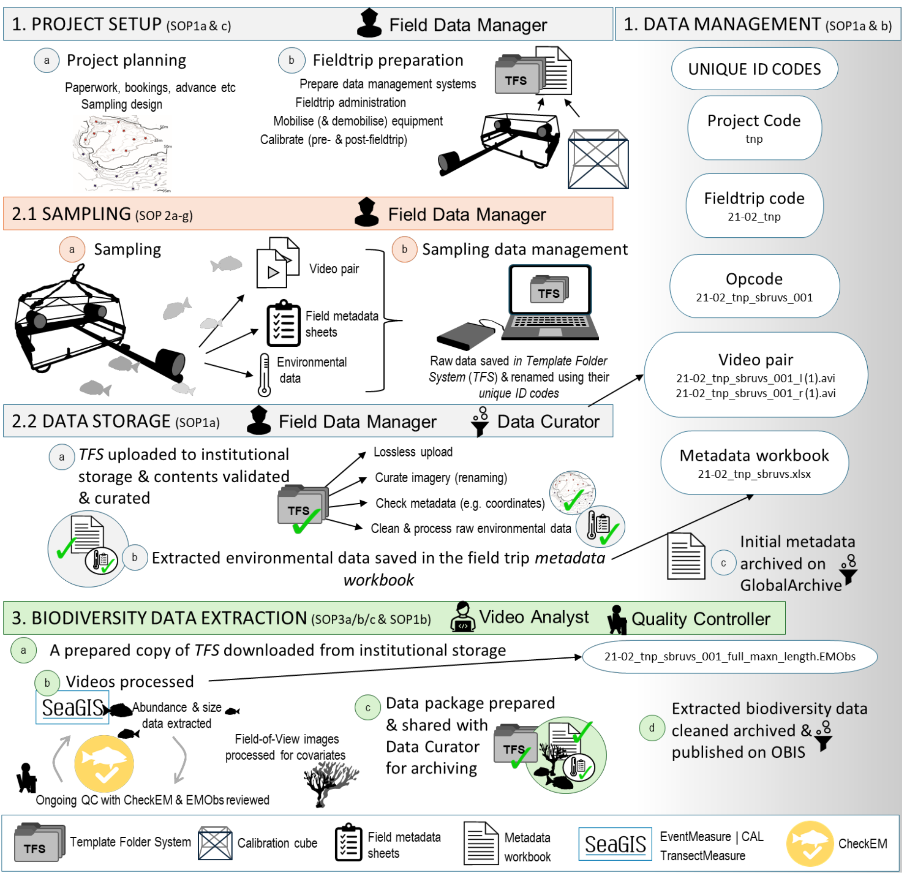

<a href="https://nrf-saiab-marip.github.io/">Home</a> - 
<a href="https://saiab.ac.za/platforms/marine-remote-imagery-platform-mar-ip/" target="_blank">About</a> -
<a href="https://nrf-saiab-marip.github.io/SOPs-Resources/">SOPs & Resources</a> - 
<a href="https://nrf-saiab-marip.github.io/SOPs-Resources/">Downloads</a> - 
<a href="mailto:atf.bernard@saiab.nrf.ac.za?cc=e.heyns-veale@saiab.nrf.ac.za,a.vanwyk@saiab.nrf.ac.za&subject=MARIP%20Website%20Inquiry">Contact</a>

 

# Getting Started with MaRIP Shared Resources

If this is your first time working on a MaRIP project, follow the three phases below in order. If you are already familiar with the setup and just need to find something, skip to the [Quick Reference](#quick-reference) section at the bottom or go straight to [Downloads](downloads.md).

## Phase 1 — Download and Read SOP1a

Before doing anything else, download and read <a href="https://drive.google.com/file/d/1wcK9LaCjf0wBrzzcJuivJ1hlzMvInafJ/preview" target="_blank">SOP1a: Project Setup and Data Management</a>.

<iframe src="https://drive.google.com/file/d/1wcK9LaCjf0wBrzzcJuivJ1hlzMvInafJ/preview" width="100%" height="500px" ></iframe>

**Location in Shared Resources:**
`1_project_setup > 1.1_data_management > SOP1a - Project setup and Data management`

SOP1a is the foundation document for all MaRIP projects. It contains:

- Complete project workflow (Figure 1)
- Project setup decision tree (Figure 2) — helps you choose your setup option
- SOP framework overview
- Data management systems:
  - Role-based workflow
  - Template folder system (TFS)
  - Unique identifiers
  - Storage guidance
- Shared Resources layout (Figure 6) and how to use them
- SOP Decision Tree (Figure 7) — helps you choose which SOPs to download

   
  <em>Figure 1: Complete MaRIP project workflow</em>

## Phase 2 — Implement the Steps in SOP1a

### Step 1: Choose Your Setup

Refer to the project setup decision tree in SOP1a (Figure 2) to confirm which option applies to you.

<iframe src="https://drive.google.com/file/d/13nf0uaZjpP-QokfQUO__gxV727XF38hu/preview" width="100%" height="500px" ></iframe>

**Option 1 — New Project** *(permits, ethics, and full setup required)*

1. Prepare your hard drive for field sampling
2. Download the full `project` folder system from:
`1_project_setup > 1.1_data_management > template_folder_system`
3. Rename the folder using your project unique identifier code

**Option 2 — Existing Project**

1. Prepare your hard drive for field sampling
2. Download only the `fieldtrip` component of the template folder system onto your hard drive

**Option 3 — Video Analyst**

1. Prepare your workspace:
   - **At SAIAB:** Access videos directly from the Network Attached Storage (NAS). Get access to the student workspace and create a working folder there.
   - **Remote workers:** Obtain the populated fieldtrip folder on a hard drive and create a working folder on your local drive.
2. Download only the `3_data_extraction` component of the template folder system to your workspace
3. For shared resources, either:
   - Download shared resources once to a central location outside your project folders, or
   - Follow standard TFS and populate `1_resources` in each fieldtrip folder *(note: this causes duplication but matches TFS structure)*

### Step 2: Populate Your Resources Folder

Use SOP1a to populate your folder with the resources you need from Shared Resources:

- Reference the Shared Resources Layout (SOP1a Figure 6)
- Use the SOP Decision Tree (SOP1a Figure 7) to choose the appropriate SOPs for your role
- Save resources to: `template_folder_system > project_name > 2_data_collection > fieldtrip > method > 1_resources`

   
  <em>Figure 6: Shared Resources folder layout</em>

   
  <em>Figure 7: SOP Decision Tree</em>

## Phase 3 — Read the Relevant SOPs for Your Role

Once your folder is set up and populated, read the SOPs that apply to your role and methods. Use the SOP Decision Tree (SOP1a Figure 7) if you are unsure which apply to you. All SOPs are available on the [Downloads](downloads.md) page.

## Quick Reference

Already familiar with the setup and just need to find something?

| Resource | Purpose |
|---|---|
| `Shared_resources.png` | Visual map of the entire Shared Resources folder |
| `SOP_decision_tree.pdf` | Guidance for choosing the appropriate SOP for your role |

Both files are available on the [Downloads](downloads.md) page.

  

(<a href="#readme-top">back to top</a>)

